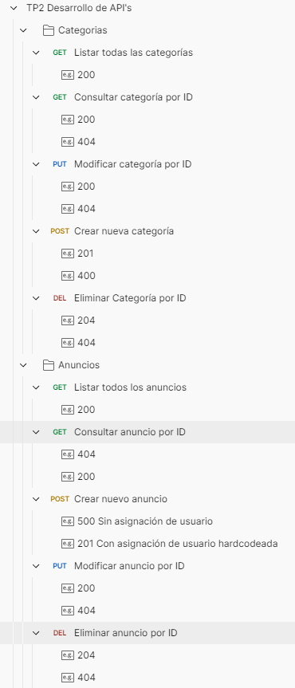

# Subastas Clase - Resumen de Cambios Agregados

### PR #1 - `feature/Paula`
Cambios principales:
- Se agrego Django REST Framework en `INSTALLED_APPS`.
- Se configuró `REST_FRAMEWORK` con `JSONRenderer` y `BrowsableAPIRenderer`.
- Se creó `apps/anuncio/api.py` con vistas `APIView` para CRUD de `Categoria`.
- Se creó `apps/anuncio/url.py` y se montaron rutas en `subastas_clase/urls.py`.
- Se creó `apps/anuncio/serializers.py` con `CategoriaSerializer` y `AnuncioSerializer` base.
- Se ajustó `__str__` en `Anuncio`.
- Se agregó `.gitignore` para entornos virtuales, sqlite y caches.

Archivos tocados:
- `.gitignore`
- `apps/anuncio/api.py`
- `apps/anuncio/models.py`
- `apps/anuncio/serializers.py`
- `apps/anuncio/url.py`
- `subastas_clase/settings.py`
- `subastas_clase/urls.py`

### PR #2 - `feature/Valentino`
Cambios principales:
- Se extendió `apps/anuncio/api.py` con CRUD de `Anuncio` via `APIView`.
- En el alta de anuncio, `publicado_por` se fuerza con `Usuario` id=1.
- Se ampliaron rutas en `apps/anuncio/url.py` para endpoints de anuncio.
- Se actualizó `db.sqlite3` (cambio binario).

Archivos tocados:
- `apps/anuncio/api.py`
- `apps/anuncio/url.py`

### PR #3 - `feature/paula-valentino-pair` (Hecho en conjunto)
Cambios principales:
- Integración conjunta de categorias y anuncios.
- Consolidation de API, serializers y rutas del módulo `anuncio`.

Archivos tocados:
- `apps/anuncio/serializers.py`

Cambio en el Serializer de Anuncio:
- Asociamos a la creación y actualización de Anuncio, la selección de al menos una categoría existente.
- En AnuncioSerializer, write_only=True en categorias_ids significa que ese campo solo se usa para recibir datos en POST/PUT, pero no se muestra en las respuestas. En cambio, read_only=True (categorias) significa que ese campo sí se devuelve en GET, pero no se puede enviar para modificarlo directamente en la entrada.

## Pruebas en postman

 
## Referencias de PR

- PR #1: <https://github.com/valentinomarchettti/desarrollo-apis-tp2/pull/1>
- PR #2: <https://github.com/valentinomarchettti/desarrollo-apis-tp2/pull/2>
- PR #3: <https://github.com/valentinomarchettti/desarrollo-apis-tp2/pull/3>